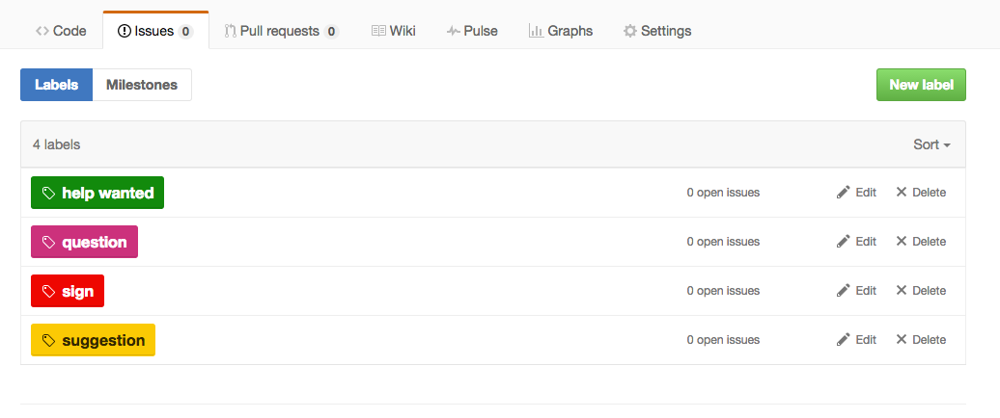

# Signing

Sometimes you need to be really sure people have seen or read or done something.
Memories fail, but having *signed* issues on a project do not. Everyone has a 
record of it. This helps students, instructors, teacher assistants, and parents
all know when the signing happened.

## Create a Custom Label

Unfortunately GitHub classroom does not retain the custom labels and issues from the starter assignment repos.
However the steps to creating one are not that difficult and provide a valuable skill that students take
with them into their GitHub lives outside of your classroom. [Here's how to create a custom label.][label]

[label]: https://help.github.com/articles/creating-and-editing-labels-for-issues-and-pull-requests/

You might want to create others at the same time and removed some of the irrelevant ones:

You, the instructor, can create the labels or your students can create them depending on their skill level.
[For our 10-year-olds teacher assistants help them through it.]

## Open an Issue

This is a simple as clicking on Issues and then "New Issue" The title of the issue should indicate what the 
signing is about and comments should maybe contain links to the relevant material inside the repo or elsewhere.
For example, perhaps you have a site with a Code of Conduct elsewhere that needs to be read and understood. 
Create a link to that in the comments.

## Label the Issue

From the right of the screen you can label the issue as *sign* (in this case).

## Assign the Issue

There will probably only be two people on the repo if you are using GitHub classroom assignment repos but
it still makes sense to set the student as the one assigned to *sign*.

## Close the Issue

Have the student close the issue with an optional comment as well. Make sure students understand that by
closing the issue they are saying they have fulfilled whatever was required or agreed to what was in
the issue.

---
[][CC0]
[CC0]: https://creativecommons.org/share-your-work/public-domain/cc0/
